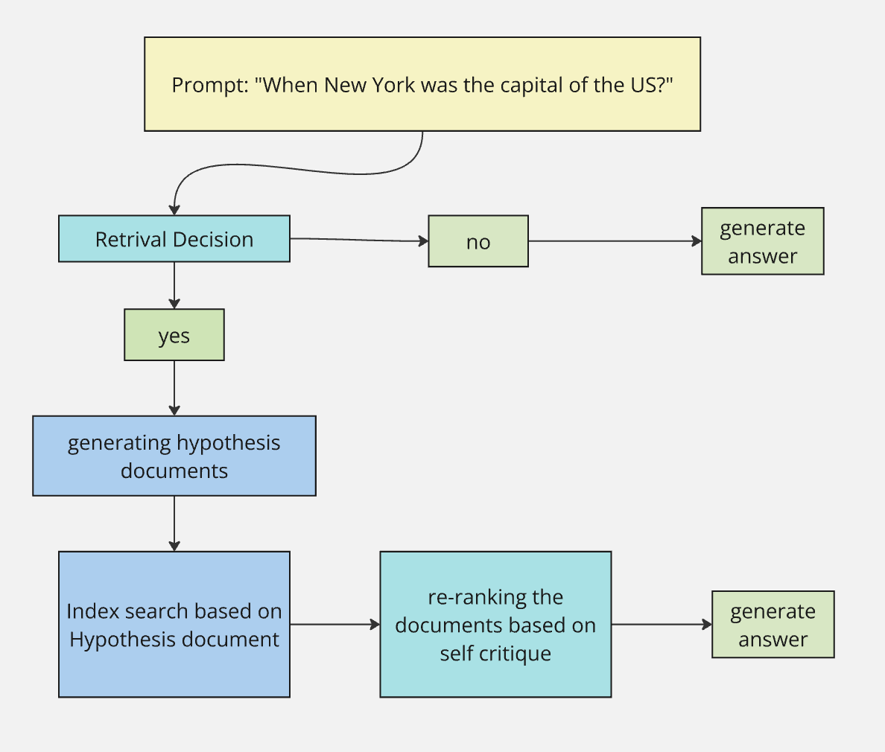

# Self-HyDE: Self-Reflective Hypothetical Document Embeddings

This repository implements a combination of HyDE (Hypothetical Document Embeddings) and SelfRAG approaches for improved zero-shot dense retrieval. It contains the adaptation of the original HyDE paper with changes to the evaluation dataset (SQuAD instead of MS MARCO), custom Wikipedia-scraped index (3.4k documents), comprehensive logging, and a lower-level implementation replacing Pyserini for better control over the retrieval pipeline. 

I used questions from the dataset as queries. Compared the highest ranking retrieved passage to the context provided in the dataset. The passages were taken from the index built based on the Wikipedia scraping. I compared model's answer to the answer provided in the dataset. ROUGE metrics 1,2,L (where 1 is overlap of words, 2 overlap of bigrams, L overlap of longest common subsequence) were used to evaluate the quality of the retrieved passages and the model's answer. The answer relevance was calculated using cross-encoder/qnli-electra-base model, which provides a semantic similarity score between the ground truth and generated answers.

> **The adaptation of HyDE scored higher than baseline on ROUGE 1,2,L for both answer similarity and retrieval quality (context similarity). It also outperfromed basedline on relevance score**

Self HyDE enhances the original HyDE method with self-reflection capabilities from SelfRAG.
Firstly it uses LLM as a judge to determine if the retrieval is needed for a given query. If retrival is nessesary it uses another LLM as a judge agent to score the relevance and support of the retrieved documents. The model uses that data to re rank the passages and generate the final response. This enhancement is based on the SelfRAG paper cited in the references. 

> **Self HyDE scored higher than baseline and higher than the adapted HyDE on ROUGE 1,2,L for answer similarity**

## Overview

This implementation is built upon the intersection of two RAG enhancement techniques:
1. **HyDE**: Uses language models to generate hypothetical documents for better retrieval
2. **SelfRAG**: Adds self-reflection to decide when to retrieve passages and critique passages retrived absed on thir relevance and suport in answering the query.  



## Set up

First, you have to crate env file and add your OpenAI API key to it.
Copy `.env.example`, rename it to `.env`, and add your OpenAI API key to it.

Dependency management is done though [poetry](https://python-poetry.org/). To install the dependencies, run:

```bash
poetry shell 
poetry install
```

it is going to create a poetry lock file. If you want to add more dependencies you can do it by running:

```bash
poetry add <dependency>
```
if you significanly change the dependencies you can update the lock file by running:
```bash
poetry lock
```

## Dataset 

The dataset used for evaluation is SQuAD 1.1. 
This is a reading comprehension dataset consisting of questions posed by crowdworkers on a set of Wikipedia articles. 
More info on [official SQuAD page](https://rajpurkar.github.io/SQuAD-explorer/). The dataset was fileted to include only the most frequenlty occuring topic: New York City (~800 questions). 

## Index corpus

The index corpus for retrieval was build by scraping wikipedia. You can re create the corpus by running the scraping file. 

```bash
python create_corpus.py
```

Alternatively I pushed the json with scraped data to the repo (`new_york_corpus.json`).

## Demos

Repo has 2 demos: 
1. HyDE demo (adapted original HyDE paper): `demo_hyde.py`
2. Self-HyDE demo (extended Hyde with Self RAG framwork from SelfRAG paper): `demo_self_hyde.py`
Self-HyDE demo shows both step-by-step and end-to-end execution which should be helpful for understanding the system

## Testing

To run unit tests:
```bash
pytest tests/
```

## Evaluation

There are 2 evaluation files:
1. `evals_hyde.py` - evaluation of my adaptation of HyDE paper
2. `evals_self_hyde.py` - evaluation of Self-HyDE (Self Rag concepts built on top of my version of HyDE)

I also pushed the initial evalaution results in `nyc_rag_evaluation_results.json` file

## Next Steps

1. Build larger index/use msmarco index and test on a larger with a broader range of topics and questions
2. Improve evaluation by setting up more comprehensive evalaution of the LLM judges (relevance/support scores). 
3. Work on decreased latency by implementing batching and parallelization 
4. Do method iteration to increase percentage improvement of Self HyDE and adapted HyDE over baseline. 

## References

This implementation builds upon two key papers:

1. **HyDE: Hypothetical Document Embeddings**
```bibtex
@article{hyde,
  title = {Precise Zero-Shot Dense Retrieval without Relevance Labels},
  author = {Luyu Gao and Xueguang Ma and Jimmy Lin and Jamie Callan},
  journal={arXiv preprint arXiv:2212.10496},
  year = {2022},
  url={https://aclanthology.org/2023.acl-long.99.pdf}
}
```

2. **SelfRAG: Self-Reflective Retrieval**
```bibtex
@inproceedings{
  asai2024selfrag,
  author={Asai, Akari and Wu, Zeqiu and Wang, Yizhong and Sil, Avirup and Hajishirzi, Hannaneh},
  title={Self-{RAG}: Learning to Retrieve, Generate, and Critique through Self-Reflection},
  booktitle={The Twelfth International Conference on Learning Representations},
  year={2024},
  url={https://arxiv.org/pdf/2310.11511}
}
```


